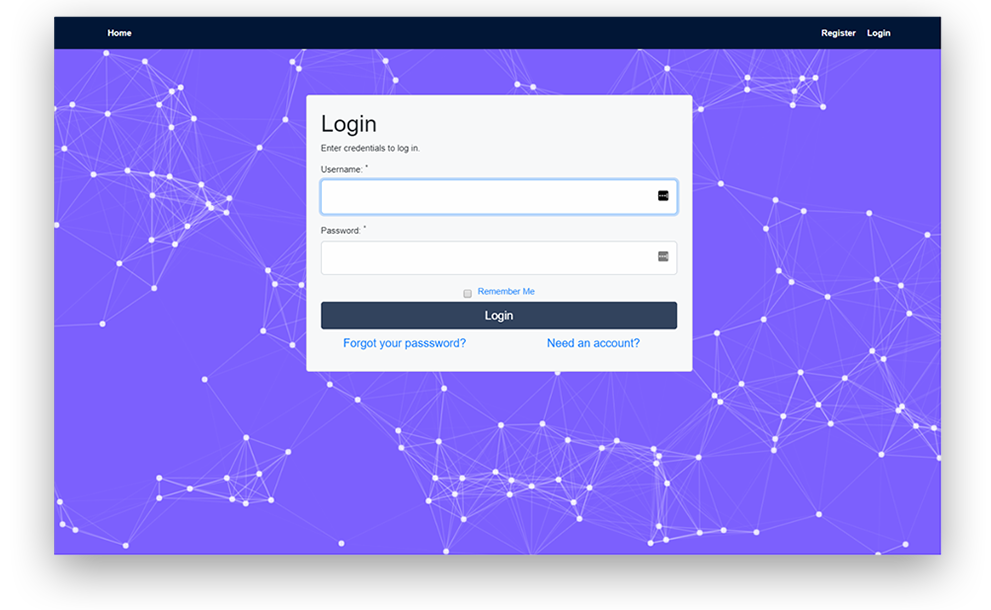

<h1 align="center">Complete PHP Authentication</h1>

&nbsp;&nbsp;&nbsp;&nbsp;&nbsp;&nbsp;&nbsp;

---

The aim of this project is to build the complete user login and registration component of a web application using PHP. This project has the following features:
+ Login / Registration.
+ Profile Management.
+ Forgot/Reset Password.
+ Remember Me Option.
+ Deactivate Account.
+ Email Verification.
+ Account Validation.
+ XSS & SQL injection prevention.

The project has been deployed on Heroku so that you can take it for a spin by clicking on the "Demo" link below. I used Cmdr in combination with heroku's CLI to push the project on a remote heroku branch and it will remain accessible, as long as I do not run out of my monthly dynos (which is plenty).

Try it out: 
## [DEMO](https://php-authentication.herokuapp.com/)

 

#### SCREENSHOTS:

Tools used:
+ HTML
+ CSS
+ Php
+ Bootstrap
+ JavaScript
+ jQuery
+ PHPMailer
+ MySQL
+ MySQL Workbench
+ Git
+ Sublime
+ Cmder
+ Xampp
+ Heroku

Please let me know of any corrections or suggestions you would like me to be aware of.
